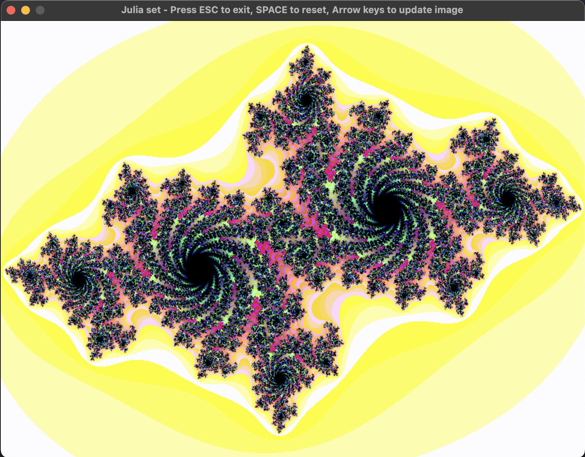
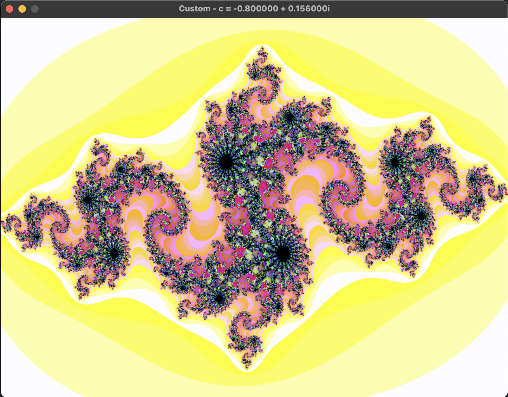
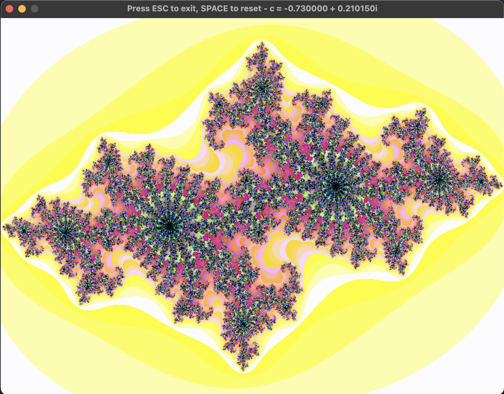

# CPPND: Capstone Julia Fractal Generator

This is a repo for the Capstone project in the [Udacity C++ Nanodegree Program](https://www.udacity.com/course/c-plus-plus-nanodegree--nd213). The code for this repo was adapted from a Julia set program by [Katsumi](https://gist.github.com/KatsumiKougen/74468b3c1c4b9844f6f77a2922f588f9).

This Capstone Project generates various fractals from the Julia set and renders them using the SDL2 library. The program initially generates a pre-defined fractal. The fractal can be updated by using the arrow keys to adjust the real and imaginary parameters (see below). Additionally, pre-defined fractals, with parameters read from an associated txt file, can be generated by using the 1 - 9 number keys. For each new fractal, the SDL window updates to show the real and imaginary parameters used to generate the fractal. At any time, the SPACE key can be used to reset to the original fractal and the ESC key is used to exit the program.

| INPUT           |    ACTION     |
| :-------------: | :-----------: |
| SPACE           |     reset     |
| ESC             |      exit     |
| UP arrow        |  real + 0.01  |
| DOWN arrow      |  real - 0.01  |
| RIGHT arrow     |  imag + 0.01  |
| LEFT arrow      |  imag - 0.01  |
| 1 - 9           |  custom 1-9   |

## Example Output
Initial Fractal

Pre-defined 8

Custom user input

## Dependencies for Running Locally

* cmake >= 3.7
  * All OSes: [click here for installation instructions](https://cmake.org/install/)
* make >= 4.1 (Linux, Mac), 3.81 (Windows)
  * Linux: make is installed by default on most Linux distros
  * Mac: [install Xcode command line tools to get make](https://developer.apple.com/xcode/features/)
  * Windows: [Click here for installation instructions](http://gnuwin32.sourceforge.net/packages/make.htm)
* SDL2 >= 2.0
  * All installation instructions can be found [here](https://wiki.libsdl.org/Installation)
* gcc/g++ >= 5.4
  * Linux: gcc / g++ is installed by default on most Linux distros
  * Mac: same deal as make - [install Xcode command line tools](https://developer.apple.com/xcode/features/)
  * Windows: recommend using [MinGW](http://www.mingw.org/)

## Basic Build Instructions

1. Clone this repo.
2. A Makefile is include for convenience, simply run `make build` to build and compile the program.
3. Run the program with `./build/JuliaSet`
4. `make clean` can be run to remove the build directly

## Rubric Criteria Satisfaction

1. *The project demonstrates an understanding of C++ functions and control structures.*
  - The entire project is organized into functions, with various control structures used throughout
2. *The project reads data from a file and process the data, or the program writes data to a file.*
  - 9 pre-defined fractals are read from the predefined_fractals.txt file
  - a map is used to organize the 9 options with the associated SDL key code
3. *The project accepts user input and processes the input.*
  - The user is able to use arrow and number keys to generate new fractals
  - The user is able to use the SPACE key to reset the fractal
  - The user is able to use the ESC key to exit the program
4. *The project uses Object Oriented Programming techniques.*
  - Classes are used throughout entire program
  - Example: class Julia in julia.h
5. *Classes use appropriate access specifiers for class members.*
  - Classes use public and private access specifiers as required
  - Example: public methods vs private members in julia.h
6. *Class constructors utilize member initialization lists.*
  - Example: Renderer in renderer.cpp
7. *Overloaded functions allow the same function to operate on different parameters.*
  - UpdateWindowTitle in renderer.cpp is overloaded to either accept a custom window title or not